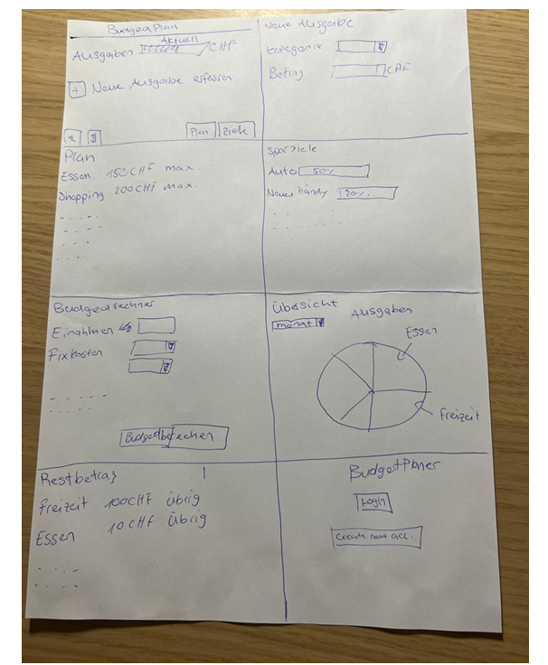
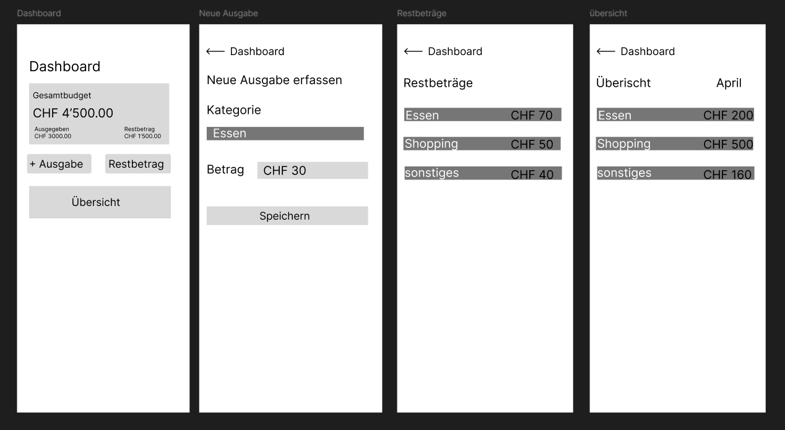
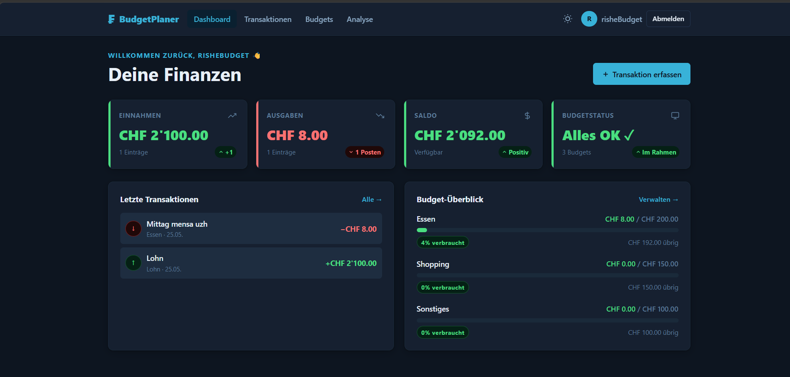
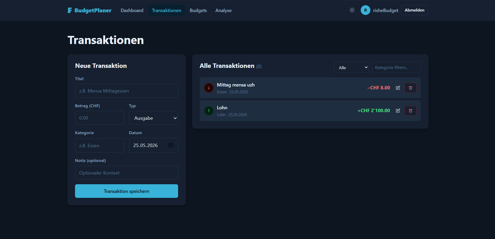
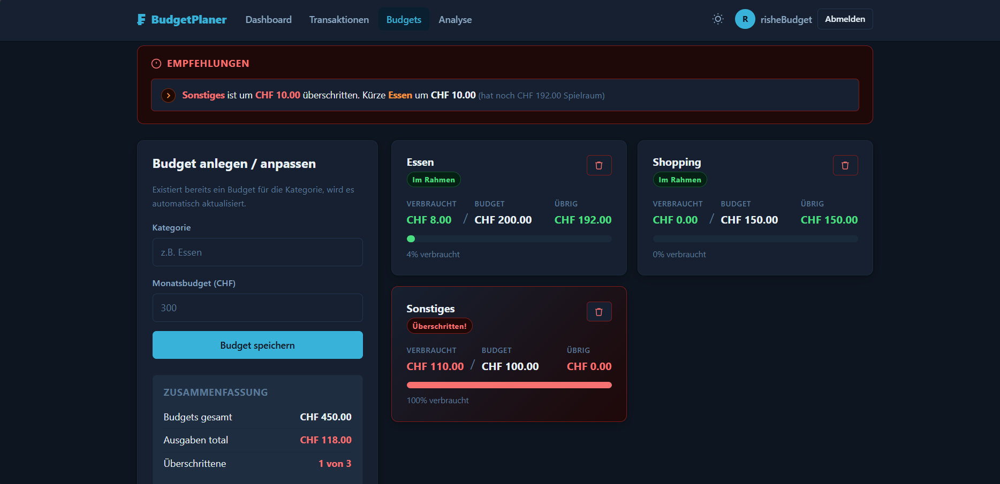
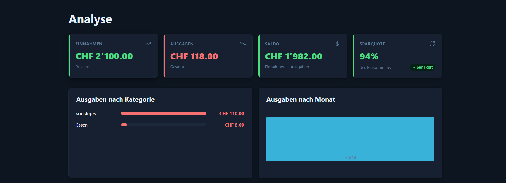
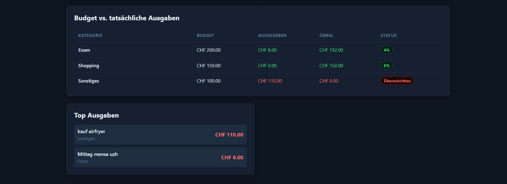

# Projektdokumentation – BudgetPlaner

## Inhaltsverzeichnis

1. [Ausgangslage](#1-ausgangslage)
2. [Lösungsidee](#2-lösungsidee)
3. [Vorgehen & Artefakte](#3-vorgehen--artefakte)
    1. [Understand & Define](#31-understand--define)
    2. [Sketch](#32-sketch)
    3. [Decide](#33-decide)
    4. [Prototype](#34-prototype)
    5. [Validate](#35-validate)
4. [Erweiterungen](#4-erweiterungen)
5. [Projektorganisation](#5-projektorganisation)
6. [KI-Deklaration](#6-ki-deklaration)
7. [Anhang](#7-anhang)

> **Hinweis:** Massgeblich sind die im **Unterricht** und auf **Moodle** kommunizierten Anforderungen.

<!-- WICHTIG: DIE KAPITELSTRUKTUR DARF NICHT VERÄNDERT WERDEN! -->

---

## 1. Ausgangslage

Viele Studierende und junge Erwachsene haben keinen guten Überblick über ihre monatlichen Einnahmen und Ausgaben. Ohne klare Übersicht wird das Budget oft unbewusst überschritten — meistens merkt man es erst, wenn das Geld bereits weg ist.

- **Problem:** Studierende mit knappem monatlichem Budget verlieren schnell den Überblick über ihre Finanzen. Ausgaben in verschiedenen Kategorien (Essen, Transport, Freizeit) summieren sich unbemerkt, bis das Budget erschöpft ist. Es fehlt ein einfaches Werkzeug, das schnell zeigt, wo das Geld hinfliesst und wann ein Budgetlimit erreicht wird.
- **Ziele:**
  - Einnahmen und Ausgaben einfach erfassen und verwalten
  - Monatliche Budgets pro Kategorie setzen und überwachen
  - Schnellen visuellen Überblick über den Finanzzustand bieten
  - Bei Budgetüberschreitungen aktiv warnen und Empfehlungen geben
- **Primäre Zielgruppe:** Studierende und junge Erwachsene (18–28 Jahre) mit begrenztem monatlichem Budget, die einen einfachen Einstieg in die persönliche Finanzverwaltung suchen.
- **Weitere Stakeholder:** Familien (zukünftig), die einen gemeinsamen Budgetüberblick benötigen; sowie KMUs (zukünftig), die eine einfache interne Budgetplanung suchen.

---

## 2. Lösungsidee

BudgetPlaner ist eine webbasierte Applikation, mit der Nutzende ihre persönlichen Finanzen übersichtlich verwalten können. Nach der Registrierung können Transaktionen erfasst, Budgets gesetzt und Ausgabenmuster analysiert werden.

- **Kernfunktionalität:**
  - **Dashboard:** Übersicht über Gesamteinnahmen, -ausgaben, Saldo und Budgetstatus auf einen Blick.
  - **Transaktionen:** Einnahmen und Ausgaben erfassen (Titel, Betrag, Kategorie, Datum, Notiz), bearbeiten und löschen. Filterung nach Typ und Kategorie.
  - **Budgets:** Monatsbudgets pro Kategorie anlegen oder anpassen. Automatische Empfehlungen bei Überschreitungen.
  - **Analyse:** Visualisierung der Ausgaben nach Kategorie (Balkendiagramm), nach Monat (Säulendiagramm), Budget-vs.-Ist-Tabelle und Top-Ausgaben-Liste.
  - **Authentifizierung:** Registrierung und Login mit sicherer Session-Verwaltung.

- **Annahmen:** Es wird davon ausgegangen, dass Nutzende bereit sind, ihre Transaktionen manuell einzugeben. Eine Bankanbindung ist nicht vorgesehen.

- **Abgrenzung:** Keine automatische Buchungsimport-Funktion, keine Mehrkonto-Verwaltung, keine mobile App. Der Prototyp ist auf die Schweizer Währung CHF ausgelegt.

---

## 3. Vorgehen & Artefakte

Die Durchführung erfolgt phasenbasiert; dokumentiert sind die wichtigsten Ergebnisse je Phase.

### 3.1 Understand & Define

- **Zielgruppenverständnis:** Die Zielgruppe sind Studierende und junge Erwachsene, die erstmals eigenständig ihr Budget verwalten müssen (z.B. nach Einzug in eine WG). Sie suchen keine komplexe Buchhaltungssoftware, sondern ein einfaches, schnell verständliches Werkzeug.
- **Wesentliche Erkenntnisse:**
  - Bestehende Apps (z.B. Bankapp-Auswertungen) sind oft zu komplex oder zu wenig auf persönliche Budgets ausgerichtet
  - Kategorisierung von Ausgaben ist zentrales Bedürfnis
  - Wichtig: unmittelbares Feedback, wenn ein Budget überschritten wird

### 3.2 Sketch

- **Variantenüberblick:** Auf einem einzigen Papier-Sketch wurden mehrere Konzeptvarianten und UI-Bereiche parallel skizziert und gegeneinander abgewogen. Die Ideen umfassten: eine kompakte Hauptansicht mit Ausgaben-Schnellerfassung, eine Plan/Ziele-Ansicht mit Sparzielen (prozentual), einen Budgetrechner (Einnahmen minus Fixkosten), eine Kuchendiagramm-Übersicht und eine einfache Login-/Registrierungs-Seite.

- **Skizzen:**

  

  Die Skizze zeigt folgende Varianten und Ideen:
  - **Dashboard-Variante:** Gesamtübersicht mit Ausgaben-Anzeige (CHF), direkter Schnellerfassung „Neue Ausgabe" (Kategorie + Betrag) und Button „Neue Ausgabe erfassen"
  - **Plan/Ziele-Variante:** Zwei Tabs (Plan | Ziele) — im Plan-Tab kategorienbasierte Budgets (z.B. Essen 150 CHF max, Shopping 200 CHF max), im Ziele-Tab prozentuale Sparziele (z.B. Auto 50%, Neues Handy 120%)
  - **Budgetrechner-Variante:** Eingabeformular für Einnahmen und Fixkosten mit „Budgetberechnen"-Button — automatische Berechnung des verfügbaren Restbudgets
  - **Übersicht-Variante:** Kuchendiagramm zur Visualisierung der Ausgaben nach Kategorie (Essen, Freizeit etc.) mit Monatsfilter
  - **Restbetrag-Variante:** Einfache Listenansicht pro Kategorie (z.B. Freizeit 100 CHF übrig, Essen 10 CHF übrig)
  - **Authentifizierung:** Login- und Registrierungs-Screen (Create new acc)

### 3.3 Decide

- **Gewählte Variante & Begründung:** Gewählt wurde die Dashboard-zentrierte Variante mit kategorienbased Budgets (Plan-Tab). Die Sparziele-Variante wurde als zu komplex für einen ersten Prototyp eingestuft. Der Budgetrechner-Ansatz wurde in vereinfachter Form ins Dashboard integriert (Saldo-Karte). Entscheidend war, dass Nutzende auf der Startseite sofort den Überblick haben, ohne erst navigieren zu müssen.

- **End-to-End-Ablauf:** Der typische Nutzerfluss beginnt mit der Registrierung (`/register`), führt über das Dashboard zur Transaktionserfassung (`/transactions`), dann zur Budgetverwaltung (`/budgets`) und schliesslich zur Analyse-Seite (`/analysis`) für die Auswertung. Von überall aus ist die Navigation persistent zugänglich.

- **Mockup:** [Figma-Mockup öffnen](https://www.figma.com/design/RItQief8ls681HBYnT90af/BudgetPlaner?node-id=0-1&m=dev&t=KSmjbjGpSJ852lRW-1)

  Das Mockup zeigt 4 mobile Screens:

  

  | Screen | Beschreibung |
  |---|---|
  | **Dashboard** | Gesamtbudget CHF 4'500, Ausgegeben CHF 3'000, Restbetrag CHF 1'500; Buttons: + Ausgabe, Restbetrag, Übersicht |
  | **Neue Ausgabe erfassen** | Formular mit Kategorie (z.B. Essen) und Betrag (CHF 30), Button „Speichern" |
  | **Restbeträge** | Kategorieliste mit verbliebenem Budget (Essen CHF 70, Shopping CHF 50, Sonstiges CHF 40) |
  | **Übersicht** | Monatliche Ausgaben nach Kategorie (April: Essen CHF 200, Shopping CHF 500, Sonstiges CHF 160) |

### 3.4 Prototype

#### 3.4.1 Entwurf (Design)

Beschreibt die Gestaltung und Interaktion des umgesetzten Prototyps.

- **Informationsarchitektur:** Die App ist in vier Hauptbereiche gegliedert, die über eine persistente Navigation erreichbar sind:
  - `/` – Dashboard (Übersicht)
  - `/transactions` – Transaktionen (Erfassen, Bearbeiten, Filtern)
  - `/budgets` – Budgets (Verwalten, Empfehlungen)
  - `/analysis` – Analyse (Diagramme, Tabellen)
  - `/login` / `/register` – Authentifizierung

- **User Interface Design:**

  **Dashboard** — vier KPI-Karten (Einnahmen, Ausgaben, Saldo, Budgetstatus), darunter die letzten Transaktionen und eine Budget-Fortschrittsübersicht pro Kategorie.

  

  **Transaktionen** — zweispaltiges Layout: links das Erfassungsformular (Titel, Betrag, Typ, Kategorie, Datum, Notiz), rechts die filterbare Transaktionsliste mit Bearbeiten- und Löschen-Funktion.

  

  **Budgets** — Budgetkarten pro Kategorie mit Fortschrittsbalken und Farbkodierung; bei Überschreitungen erscheint automatisch ein Empfehlungsblock.

  

  **Analyse** — Ausgaben nach Kategorie (horizontales Balkendiagramm), Ausgaben nach Monat (Säulendiagramm, letzte 6 Monate), Budget-vs.-Ist-Tabelle und Top-Ausgaben-Liste.

  

  

- **Designentscheidungen:**
  - Farbkodierung: Grün = positiv/im Rahmen, Orange = Warnung (80–99% des Budgets), Rot = Überschreitung (≥100%)
  - Währung durchgehend in CHF mit Schweizer Formatierung (`de-CH`)
  - Responsives Layout (Grid bricht bei schmalen Bildschirmen auf eine Spalte um)
  - Inline-Formvalidierung mit Fehlermeldungen direkt unter dem betroffenen Feld

#### 3.4.2 Umsetzung (Technik)

Fasst die technische Realisierung zusammen.

- **Technologie-Stack:**
  - **Frontend:** SvelteKit 2 mit Svelte 5, Vite 8
  - **Backend:** SvelteKit Server (Form Actions, Load-Funktionen, Server Hooks)
  - **Datenbank:** MongoDB 6 (Cloud-Hosting via MongoDB Atlas)
  - **Authentifizierung:** bcryptjs (Passwort-Hashing), Cookie-basierte Sessions (30-Tage-Gültigkeit)
  - **Deployment:** Netlify (via `@sveltejs/adapter-netlify`)

- **Tooling:**
  - IDE: Visual Studio Code
  - Versionskontrolle: Git / GitHub
  - Deployment: Netlify (automatisch via GitHub-Push)
  - KI-Unterstützung: siehe Kapitel 6

- **Struktur & Komponenten:**
  ```
  src/
  ├── lib/
  │   ├── components/
  │   │   └── StatCard.svelte       # Wiederverwendbare KPI-Karte
  │   └── db.js                     # Datenbankschicht (Users, Sessions, Transactions, Budgets)
  ├── routes/
  │   ├── +layout.svelte            # Globales Layout mit Navigation
  │   ├── +layout.server.js         # Auth-Guard (Weiterleitung wenn nicht eingeloggt)
  │   ├── +page.svelte              # Dashboard
  │   ├── transactions/             # Transaktionsverwaltung (CRUD)
  │   ├── budgets/                  # Budgetverwaltung + Empfehlungen
  │   ├── analysis/                 # Analyse & Diagramme
  │   ├── login/                    # Login
  │   ├── register/                 # Registrierung
  │   └── logout/                   # Logout-Endpoint
  ├── hooks.server.js               # Session-Middleware (lädt User aus DB)
  └── app.css                       # Globale Styles (CSS-Variablen, Design-System)
  ```

- **Daten & Schnittstellen:**
  - Alle Daten werden in **MongoDB Atlas** gespeichert. Collections: `users`, `sessions`, `transactions`, `budgets`.
  - Datenzugriff ausschliesslich serverseitig über `src/lib/db.js`.
  - Kein öffentliches API — Datenaustausch erfolgt über SvelteKit Form Actions und Load-Funktionen.
  - Umgebungsvariablen: `MONGODB_URI` (in `.env`, nicht im Repository)

- **Deployment:** https://budgetplaner-final.netlify.app/

- **Besondere Entscheidungen:**
  - Budget-Upsert: Existiert bereits ein Budget für eine Kategorie, wird es automatisch aktualisiert statt dupliziert (Upsert per case-insensitivem Regex-Match).
  - Passwort-Hashing serverseitig mit bcryptjs — keine Klartextpasswörter in der Datenbank.
  - Alle Geldbeträge werden als Number (Float) in MongoDB gespeichert und erst zur Anzeige mit `Intl.NumberFormat` formatiert.
  - Die Budget-Empfehlungen werden rein clientseitig berechnet — kein zusätzlicher Server-Request nötig.

### 3.5 Validate

- **URL der getesteten Version:** https://budgetplaner-test-4c5d09.netlify.app/ *(separat deployte Testversion)*
- **Ziele der Prüfung:**
  - Ist das Dashboard intuitiv verständlich ohne Erklärung?
  - Können Nutzende selbstständig eine Transaktion erfassen?
  - Werden Budgetüberschreitungen klar wahrgenommen?
  - Ist die Analyse-Seite verständlich und nützlich?

- **Vorgehen:** [TODO: moderiert/unmoderiert; remote/on-site]
- **Stichprobe:** [TODO: Anzahl Testpersonen, kurzes Profil — z.B. Studierende, 20–25 Jahre, keine Vorkenntnisse mit Budgetapps]

- **Aufgaben/Szenarien:**
  1. „Du hast heute CHF 12.50 für das Mittagessen ausgegeben. Erfasse diese Ausgabe."
  2. „Überprüfe, ob du diesen Monat noch im Rahmen deines Essenbudgets bist."
  3. „Setze ein neues Monatsbudget von CHF 100 für die Kategorie Freizeit."
  4. „Schau dir an, in welcher Kategorie du am meisten Geld ausgibst."
  5. [TODO: weitere Aufgaben ergänzen]

- **Kennzahlen & Beobachtungen:** [TODO: Erfolgsquoten, Zeitbedarf, qualitative Findings aus dem Test]
- **Zusammenfassung der Resultate:** [TODO: 2–4 Sätze zu den wichtigsten Erkenntnissen]
- **Abgeleitete Verbesserungen:** [TODO: priorisierte Liste von Verbesserungen, die sich aus der Evaluation ergeben haben]

---

## 4. Erweiterungen

### 4.1 Intelligente Budget-Empfehlungen

- **Beschreibung & Nutzen:** Wenn ein Budget überschritten wird, schlägt die App automatisch vor, aus welcher anderen Kategorie Geld „umgeschichtet" werden könnte. Als Kandidat wird das Budget mit dem grössten verbleibenden Spielraum vorgeschlagen. Das hilft Nutzenden, schnell zu reagieren, ohne selbst alle Budgets durchrechnen zu müssen.
- **Wo umgesetzt:** Frontend — `src/routes/budgets/+page.svelte`, rein clientseitige Berechnung auf Basis der geladenen Transaktions- und Budgetdaten.
- **Referenz:** Roter Empfehlungsblock oben auf der Budgets-Seite, erscheint nur wenn mindestens ein Budget überschritten ist.
- **Aus Evaluation abgeleitet?:** [TODO: Ja/Nein]

### 4.2 Sparquote in der Analyse

- **Beschreibung & Nutzen:** Die Analyse-Seite berechnet automatisch die Sparquote (Anteil des Einkommens, das nicht ausgegeben wurde) und bewertet sie: ≥20% = sehr gut (grün), >0% = ausbaufähig (gelb), ≤0% = negativ (rot). So sehen Nutzende auf einen Blick, ob sie finanziell auf Kurs sind.
- **Wo umgesetzt:** Frontend — `src/routes/analysis/+page.svelte`, als vierte KPI-Karte in der StatCard-Reihe.
- **Referenz:** Vierter Block in der Kennzahlen-Reihe der Analyse-Seite.
- **Aus Evaluation abgeleitet?:** [TODO: Ja/Nein]

### 4.3 Transaktionsfilter nach Typ und Kategorie

- **Beschreibung & Nutzen:** Auf der Transaktionsseite können Einträge nach Typ (Einnahme/Ausgabe) und Kategoriestichwort live gefiltert werden. So behalten Nutzende auch bei vielen Einträgen den Überblick.
- **Wo umgesetzt:** Frontend — `src/routes/transactions/+page.svelte`, reaktiver Filter via Svelte-Reactive-Statements (`$:`), kein zusätzlicher Server-Request.
- **Referenz:** Filter-Leiste oben rechts in der Transaktionsliste.
- **Aus Evaluation abgeleitet?:** [TODO: Ja/Nein]

---

## 5. Projektorganisation

- **Repository & Struktur:** https://github.com/rishes-ss/budgetplaner — Ordnerstruktur siehe Kapitel 3.4.2.
- **Issue-Management:** [TODO: z.B. GitHub Issues oder informell via Notizen in VS Code]
- **Commit-Praxis:** [TODO: z.B. sprechende Commits wie `feat: add budget recommendations`, `fix: session expiry check`]

---

## 6. KI-Deklaration

### 6.1 KI-Tools

- **Eingesetzte Tools:**
  - ChatGPT (OpenAI) — Version: [TODO: z.B. GPT-4o]
  - GitHub Copilot — in VS Code integriert
  - Claude (Anthropic, Cowork-Modus) — für das Verfassen dieser README-Dokumentation

- **Zweck & Umfang:**
  - **ChatGPT:** Strukturierung der Anforderungen, Erstellung von Prompts für die Code-Generierung, Diskussion von Designentscheidungen.
  - **GitHub Copilot:** Code-Vervollständigung und -vorschläge während der Implementierung in VS Code (insbesondere Svelte-Syntax, MongoDB-Queries, Form-Actions-Muster).
  - **Claude (Cowork):** Erstellung des ersten Entwurfs dieser README-Dokumentation auf Basis des Vorlageschemas und des bestehenden Quellcodes.
  - Teile des Codes (insbesondere Datenbankschicht `db.js`, Routing-Struktur, CSS-Design-System) wurden mit KI-Unterstützung entwickelt.

- **Eigene Leistung (Abgrenzung):**
  - Konzept, Problemdefinition und Zielgruppenanalyse eigenständig erarbeitet
  - Auswahl des Technologie-Stacks und Deployment-Entscheidungen eigenständig getroffen
  - Alle KI-Vorschläge wurden überprüft, angepasst und in den eigenen Kontext integriert
  - [TODO: weitere eigenständige Leistungen ergänzen]

### 6.2 Prompt-Vorgehen

Die KI wurde primär als interaktiver Sparringspartner eingesetzt. Die Vorgehensweise war iterativ: Zuerst wurde das Problem beschrieben und eine grobe Struktur besprochen, danach wurden spezifische Funktionen Schritt für Schritt entwickelt. Dabei wurden KI-Vorschläge nie blind übernommen, sondern auf Korrektheit geprüft und an die eigenen Anforderungen angepasst.

Beim Einsatz von Copilot in VS Code wurden Vorschläge für Svelte-spezifische Muster (Form Actions, reaktive Statements `$:`) und MongoDB-Queries genutzt, die dann manuell auf die Datenstruktur des Projekts angepasst wurden.

[TODO: konkrete Beispiele für Prompts oder Prompt-Strategien ergänzen, falls gefordert]

### 6.3 Reflexion

Der KI-Einsatz hat die Entwicklungsgeschwindigkeit deutlich erhöht, insbesondere bei repetitiven Aufgaben wie Formularvalidierung und Datenbankzugriffen. Die grösste Herausforderung war das kritische Prüfen der KI-Ausgaben: Vorschläge für Svelte 5 und die SvelteKit-Form-Actions-Syntax waren teilweise auf ältere Versionen ausgerichtet, was zu zusätzlichem Debugging-Aufwand geführt hat.

Ein Risiko beim intensiven KI-Einsatz ist das sogenannte „Verständnisdefizit" — man übernimmt Code, den man nicht vollständig durchdringt. Dem wurde entgegengewirkt, indem jede grössere Funktion nachvollzogen und bei Bedarf manuell überarbeitet wurde.

[TODO: weitere persönliche Reflexion ergänzen]

---

## 7. Anhang

- **Quellen:**
  - SvelteKit Dokumentation: https://kit.svelte.dev/docs
  - MongoDB Node.js Driver: https://www.mongodb.com/docs/drivers/node/current/
  - bcryptjs: https://github.com/dcodeIO/bcrypt.js
  - Netlify Adapter für SvelteKit: https://github.com/sveltejs/kit/tree/main/packages/adapter-netlify
  - [TODO: weitere verwendete Quellen, Assets, Vorlagen ergänzen]

- **Testskript & Materialien:** [TODO: Link zu Testprotokoll oder Materialien, falls vorhanden]
- **Rohdaten/Auswertung:** [TODO: Link zu Auswertungsdatei, falls vorhanden]
